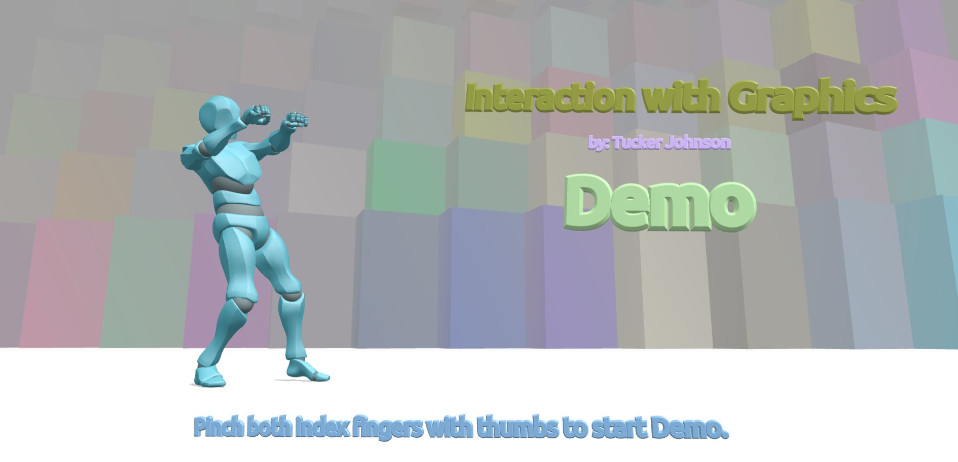
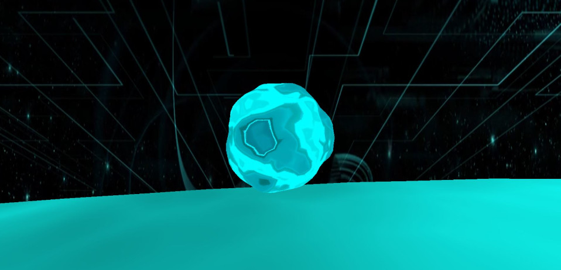

## Interaction with Graphics - Creative Coding Final Project (Spring 2021)
Creator: Tucker Johnson
University: University of St. Thomas

# Technologies Used to Create this project
- Three.js
- Handsfree.js
- Web Audio API
- Blender
- Gimp (Graphic Image Manipulation Program)
- Visual Studio Code
- JavaScript
- HTML

# Description
 Interaction with Graphics is a multimedia installation that immerses the audience in the virtual 
 realm of computer graphics through auditory, visual, and interactive queues. This time sequenced 
 project, which is entirely written in Javascript with a library called ThreeJS, implements a 
 variety of abstract and structured sequences, all of which demonstrate mathematical and 
 programming achievements made in the last 30 years, such as perlin noise and sophisticated 
 3-dimensional model rendering. The main objective of this endeavor is to remind its audience 
 of the past while demonstrating what the future holds.

The interactive queues implemented in this assignment include musical graphic syncronization
by using Web Audio API and hand interaction through the library called HandsFree. 

# Plug and Play

This project is one that is currently not available to run in the browser due to the number of files
and CORS restrictions. To Plug and Play this project you will need to clone this project to your local 
environment and run the main.html file on a local host server that is configured in your IDE. Visual Studio
Code has a great 'Live Server' plugin that makes set-up and running this repo's code a breeze. 

Steps: 
- 1. Clone the project to your local environment
- 2. Open this project in your IDE (Recommended: Visual Studio Code)
- 3. Launch Live Server and Choose Main.html to start
- 4. Follow the on screen prompts and enjoy!!

Please know that this assignment was one of experimental origin and was made to run specifically on 
a newer device within its local environment. If you experience problems getting things set up and running
please contact me with your questions and concerns. 
